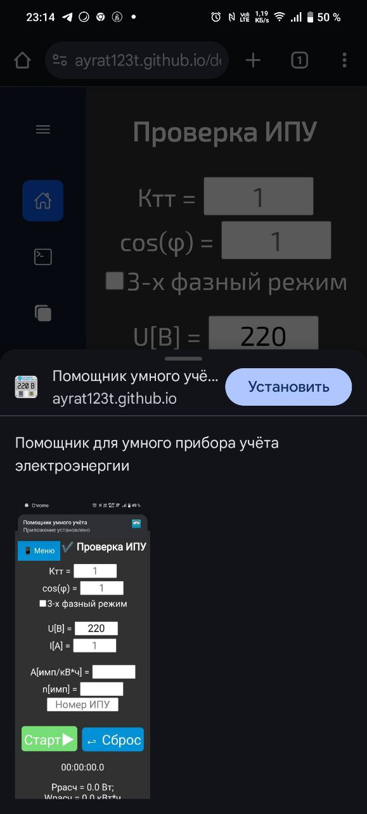
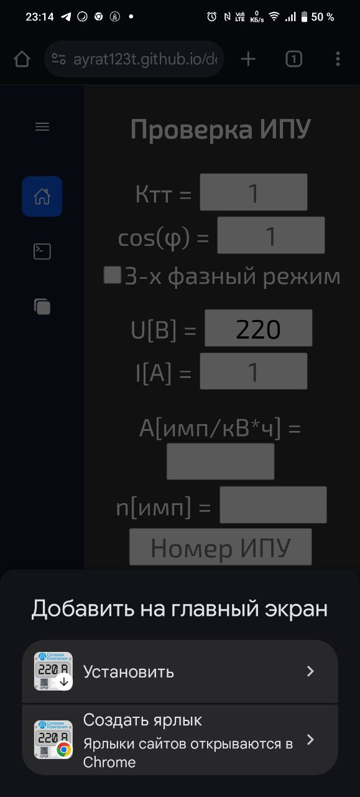

# Помощник для умного прибора учёта электроэнергии

1) Форма для проверки корректности учёта электроэнергии прибором учёта
2) Форма для расшифровки кода ошибки прибора учёта электроэнергии, которая отображается на его экране, в текстовый вид.
Расшифровка кода ошибки производится в соответствии с актуальным руководством по эксплуатации соответствующего прибора учёта.
3) Форма для расшифровки обозначения модели прибора учёта
4) Расчёт сечения кабеля

Перейти на сайт https://ayrat123t.github.io/decoding-Error-Codes-From-SMD/#

## Работает без доступа в интернет. Подключен service-worker: можно добавить на главный экран в качестве приложения

## Особенности интерфейса
- Меню-навигатор раскрывается “шторкой” поверх основного контента (страница при открытии не сдвигается).
- Интерфейс адаптивен: на смартфоне уменьшаются ширина меню и размеры элементов, чтобы формы помещались на экран.
- Результат можно скопировать в буфер обмена (сначала используется `navigator.clipboard`, при недоступности — fallback).
